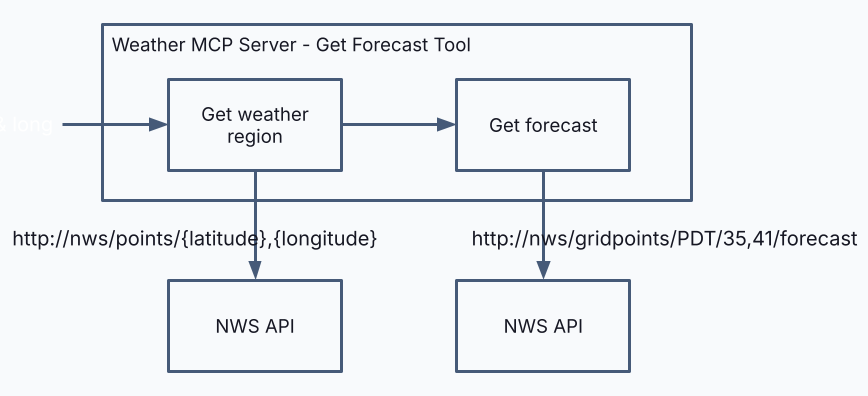

# durable-mcp

This repository contains demonstrations of durable MCP - a simple one and a more complex one:
- the simple one implements an MCP server, starting with one shown in the [MCP Server Developers Quickstart](https://modelcontextprotocol.io/quickstart/server). We add Temporal to make the server durable.
- the more complex one does quite a bit more - it:
  - includes an MCP client 
  - ... and a very simple application that uses this client
  - includes a much more sophisticated MCP server that includes elicitation and sampling
  - ... and in a separate branch, a demonstration of the remote MCP transport protocol
  - We use Temporal to make the MCP server durable.

I go more into each of the two demos below.

The main branch has an implementation that extends the initial sample with durability, using Temporal. The original implementation can be found in the nondurable branch. Each branch has its own 
version of this README, guiding you through the demonstration.

# Demo 1 - simple, but durable MCP server

In this demo we take the very simple weather MCP server from the official [MCP Server Developers Quickstart](https://modelcontextprotocol.io/quickstart/server) and we make it durable by wrapping the downstream calls to the National Weather Service (NWS) APIs in activities and orchestrate them in a workflow. I literally changed (almost) none of the original code, except to put pieces in different files with the appropriate Temporal annotations added.

The following diagram shows the business logic for the GetForecast tool:



The one thing that I did change is that I had to get rid of some of the error handling code from the original - because the exception was getting swallowed, Temporal never saw the error and couldn't compensate for it. Hmm, error handling in code might just be a bug.

I intentionally used Claude Desktop as the MCP client because we are seeing many use cases where apps are running in clients such as these. It is worth getting comfortable with this approach.

## The files
This repo contains implementations for two different MCP servers - described here are the files for the first demo.

The files that implement this first example are:
- `mcp_servers/weather.py` - this handles the MCP protocol and interfaces with the Temporal workflow 
- `workflows/weather_workflows.py` - the business logic for the tools
- `workflows/weather_activities.py` - these activities wrap the calls to the NWS APIs
- `workflows/weather_worker.py` - the worker that runs the weather workflows and activities.

These files collectively implement the MCP server. Note that in this first demo, this is the entire implementation, as we use Claude for Desktop as our MCP client.

## See it in action

See [here](https://www.youtube.com/watch?v=TIi1FfTBoOE&t=194s) for a recording where we do a series of demos centered around this use case.

## Prerequisites

In order to run the demo that can be found in this recording (link coming soon) you must have the following:

- Claude Desktop
- Python with uv installed
- A local Temporal server
- `pfctl` - simple firewall for Mac (PRs for other OSes welcome). We will use this to simulate network outages. You will need to be able to run this with `sudo`

## Setting up

Run a local Temporal service
```
temporal server start-dev
```

Configure Claude Desktop with MCP Server
This is done by placing the `clade_desktop_config.json` file into the `~/Library/Application Support/Claude` directory, inserting the appropriate path.
Restart Claude Desktop if already running. Verify that the MCP server is available:

## Running the MCP server

The MCP protocol handler will be started by Claude for Desktop. You must also start the Temporal worker (which will run the workflow and actvities).

```
uv run run_weather_worker.py
```

You can now ask Claude for the weather for a particular location. For example: `What is the weather in Honolulu, HI?`

Claude will ask you for confirmation before it invokes the weather MCP server.

The `get_forecast` tool makes two downstream HTTP requests to National Weather Service (NWS) API - one taking a lat and long and returning a "gridpoint" (a region that has a weather forcast associated with it), and a second that retrieves the forcast for that gridpoint. After tool execution, Claude Desktop will send the result over to the LLM (with other context) for human formating, and then returns that result to the user.

You can see these and other MCP-related actions in the `mcp_server.log`.

Now, play with this a bit so see how it holds up against some of the challenges that plague distributed systems.

## Simulating a network outage

The implementation of the `get_forecast` tool includes a 10 second sleep between the two HTTP requests. Experiment with the following:
- Run it with no firewall rules
- Add the firewall rules and enable the firewall
- Disable the firewall, accept the MCP tool execution and then enable the firewall within 10 seconds. Disable the firewall on the 11th second and see what happens.


### Using `pfctl` on a Mac

We will simulate a network outage by adding firewall rules using `pfctl`. This repository includes a `pf.rules` file that has URLs I am currently seeing for the NWS API. You can check what these are right now with the following command:
```
dig +short api.weather.gov
```

The following commands are used to set and delete the rules, and enable and disable the firewall.

To set rules
```
sudo pfctl -f pf.rules
```

To remove the rules. WARNING: this will delete all rules - you are using pfctl for real, use with caution.
```
sudo pfctl -F all
```

To see the current list of rules:
```
sudo pfctl -s rules
```

To enable the firewall
```
sudo pfctl -e
```

To disable the firewall
```
sudo pfctl -d
```
# Demo 2 - Advanced Durable MCP

The use case demonstrated in the advanced durable MCP demo is as follows:
- Given a topic (i.e. AI) the first step will retrieve the most recent Hacker News stories.
- For each of these stories, the URL referenced in the story is rendered.
- An LLM summarizes text from this rendering
- A single result is returned with those summaries brought together.

This logic implements the Hacker News MCP tool. The following diagram depicts the Hacker News MCP Server, Summaries Tool:


Because the MCP tool implements both elicitations and sampling, we must also implement an MCP client that implements the elicitation and sampling handlers. The MCP client runs within the client application, which is a very simple command line application. In order to focus on MCP, we have not implemented an agentic loop in the client application; instead, it supports a single shot prompt. That said, the MCP server may come back to the client for additional interaction (this will be clear very shortly).

The following diagram shows the architecture of this sample application - both the MCP server and the MCP Client and client side application.


Note that this diagram shows in pink the parts needed to implement elicitation and sampling.

## The Files

The MCP server implementation is found in the following files:

- `mcp_servers/hackernews.py` - this implements what is called the MCP Protocol Handler in the above diagram
- `workflows/hackernews_workflows.py` - this implements the business logic for the MCP Server tool.
- `workflows/hackernews_activities.py` - the activities wrap requests to the Hacker News API and fetch/render the story URL contents, plus extract the text from those rendered contents.
- `workflows/scraping.py` - helper function used in rendering story URL contents.
- `workflows/hackernews_worker.py` - runs the workflow and activities for the MCP server.

These files collectively implement the MCP server.

The client application and MCP Client are found in the following file:

- `mcp_clients/simple_client.py` - this contains both the AI Application (which for the elicitation and sampling demos is a simple cli application) as well as an embedded MCP client. The client implementation includes handlers for eliciation, sampling and MCP Sever logging.


## See it in action

See [here](https://youtu.be/6gVeAiyyt6c?si=1DU86BPBL5SzUaEW&t=222) for a recording where we do a series of demos centered around this use case.

## Prerequisites

In order to run the demo that can be found in this recording (link coming soon) you must have the following:

- Python with uv installed
- A local Temporal server

## Setting up

Run a local Temporal service
```
temporal server start-dev
```

## Running the MCP server


```uv run run_hackernews_worker.py```

This process remains running through all of the demos.

## Run the client application

```uv run run_mcp_client.py```

This application simply allows the user to provide a prompt, send that to the LLM and either returns the LLM response, or if the LLM makes a tool selection, the application will invoke the tool via MCP client.

If this is the first time asking for Hacker News, the MCP server will ask for a topic via elicitation.

## Bonus demo: Client Application is a long-running workflow

We have also included a client application (with embedded MCP client) that is a long running process, implemented as a long running Temporal workflow. Docs for this example will follow shortly.